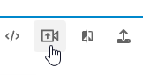
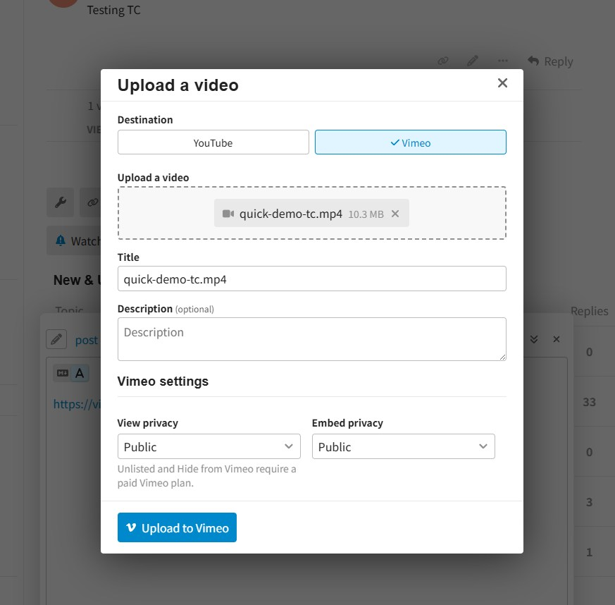
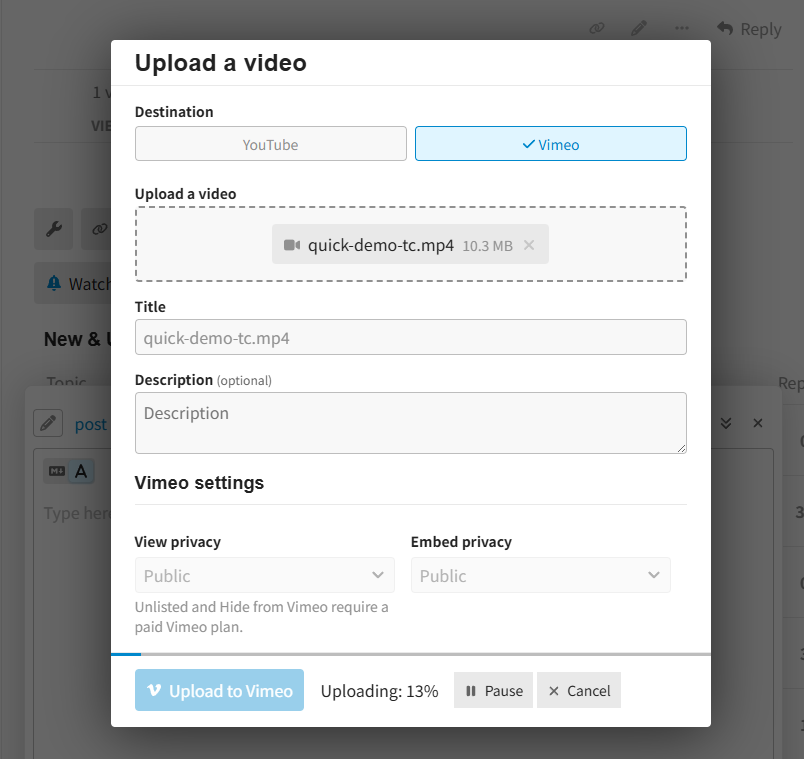
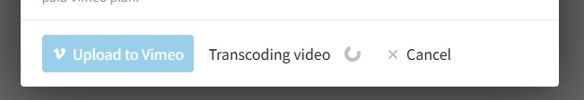
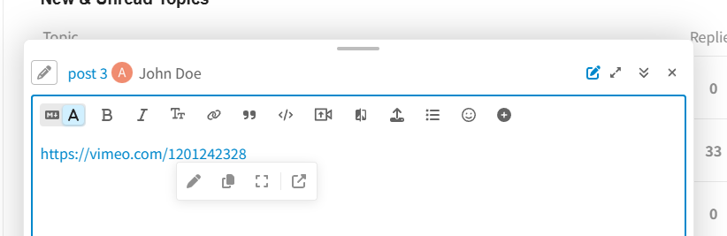

# Discourse Video Publisher

This component allows you to upload videos directly from the editor to YouTube or Vimeo and automatically inserts the resulting video link into your post once processing is complete.

> ℹ️ This is a continuation and overhaul of the original work made by @ti0 here https://meta.discourse.org/t/video-upload-to-youtube-and-vimeo-using-theme-component/170079 to make it work on the latest Discourse version with improvements and new features.

## Features

- Upload videos to YouTube or Vimeo from the editor
- Automatic insertion of the video URL into the post after processing completes
- Wait for transcoding to finish before inserting the video link
- Configurable default privacy settings
- YouTube: Uploads go directly to each user's personal channel
- Vimeo: Uploads go to a shared account

What's new

- Vimeo: New mode, uploads go directly to each user's personal channel
- Upload progress tracking with pause and resume support
- Cancel uploads or processing and automatically remove the uploaded video
- Restrict access to the upload button by user's group
- Configurable processing wait for large videos before inserting the video link

Under the hood:

- Modernizing the upload UI
- Robust upload handling: chunked, resumable, auto-retrying
- Better accessibility
- Test coverage

## Configuration

### YouTube

Videos are uploaded to the authenticated user's YouTube channel.

**1. Create a project and enable the API**

1. Go to [console.cloud.google.com](https://console.cloud.google.com)
2. Create a project
3. Enable the **YouTube Data API v3** (**APIs & Services → Library** or search _youtube_)

**2. Configure the OAuth consent screen**

1. Go to **APIs & Services → OAuth consent screen**
2. Choose **External** (or **Internal** if all users belong to one Google Workspace organization — Internal skips the verification and warning described below)
3. Complete the required application details.
4. Under **Data access** (scopes), add `../auth/youtube` scope. This scope allows the component to upload, check processing status, and delete videos when uploads are cancelled.

**3. Publish the application**

New applications start in Testing mode (**OAuth consent screen → Audience**) and can only be used by designated test users.

For production use, click **Publish app**. then complete Google's OAuth verification process for the YouTube scope (more information here: https://support.google.com/cloud/answer/13464321).

**4. Create the OAuth client ID**

1. Go to **APIs & Services → Credentials → Create credentials → OAuth client ID**
2. Application type: **Web application**
3. Under **Authorized JavaScript origins**, add your Discourse instance URL (e.g. `https://forum.example.com`)
4. Copy the generated **Client ID**

| Setting                        | Value                                        |
| ------------------------------ | -------------------------------------------- |
| `youtube upload enabled`       | Enable                                       |
| `youtube api client id`        | Paste the Client ID                          |
| `youtube default view privacy` | `unlisted` (default), `public`, or `private` |

---

### Vimeo

Vimeo supports two upload methods.

#### Mode 1 — Per-user OAuth (recommended)

Each user connects their own Vimeo account and uploads videos they personally own.

**Vimeo developer setup:**

1. Go to [Vimeo Developer Portal](https://developer.vimeo.com/apps/new) and create an app
2. On the app page, **Request upload access**
3. Add your Discourse site's root URL as an OAuth callback URL: **OAuth 2 → Authentication callback URLs**.
   Example: `https://forum.example.com` 1
4. Enable **Implicit authentication**
5. Copy the application **Client ID**

> ℹ️ 1 Unlike Google, which handles the whole sign-in flow for you, Vimeo offers no such way. So the component drives the OAuth flow itself: it opens a popup and Vimeo redirects back to your forum URL with a short-lived, per-user token.
> It works in most cases, but depending on how the forum is reached, it may fail.

| Setting                 | Value               |
| ----------------------- | ------------------- |
| `vimeo upload enabled`  | Enable              |
| `vimeo oauth client id` | Paste the Client ID |

#### Mode 2 — Shared account (advanced)

All uploads go to a single Vimeo account. Leave `vimeo oauth client id` empty and use a static access token instead.

> ⚠️ **Security Warning**
>
> Theme settings are delivered to every visitor's browser. This means anyone can extract the Vimeo access token and use it directly against your Vimeo account. 
> With the current token permissions (Upload and Delete scopes), an attacker may be able to upload and delete videos from your Vimeo account.
>
> If you're unsure which mode to use, choose **OAuth mode** instead.

> ℹ️ There are legitimate usages for using a shared account. If there is enough interest, a plugin version of this component can be made to avoid the security risks of using a static token. Let me know!

**Vimeo setup**

1. Go to [developer.vimeo.com/apps/new](https://developer.vimeo.com/apps/new) and create an app
2. On the app page, click **Request upload access**
3. Go to **Generate an access token** and create a token with the **Upload** and **Delete** scopes (Delete is used to clean up videos when an upload is cancelled)
4. Copy the generated token

| Setting                  | Value                  |
| ------------------------ | ---------------------- |
| `vimeo upload enabled`   | Enable                 |
| `vimeo oauth client id`  | Leave empty            |
| `vimeo api access token` | Paste the access token |

#### Vimeo privacy defaults

These settings apply to shared-token uploads and act as defaults for OAuth uploads.

| Setting                       | Options                            |
| ----------------------------- | ---------------------------------- |
| `vimeo default view privacy`  | `anybody`, `unlisted` or `disable` |
| `vimeo default embed privacy` | `public` or `private`              |

> `unlisted` and `disable` require a paid Vimeo plan.

---

### Access control

| Setting          | Value                                                                 |
| ---------------- | --------------------------------------------------------------------- |
| `allowed groups` | Groups whose members can see and use the video upload toolbar button. |

---

## Usage

1. Click on the upload icon

   

2. Select the provider and upload the video

   

3. Click **Upload** — a progress bar with the current percentage is shown, with **Pause** and **Resume** as needed.

   If you click **Cancel** before the upload completes, the uploaded video will be removed from the provider.

   

4. Wait for the upload and transcoding to complete

   

5. The video link is automatically inserted into the composer

   

### Large videos

Once uploaded, the provider still needs time to transcode the video before it's ready to play. 
The `processing wait timeout minutes` setting (default `10`) controls how long the component waits for that:

- A value above `0` inserts the link after that many minutes, even if the video is still processing.
- `0` waits until processing fully completes before inserting the link.
